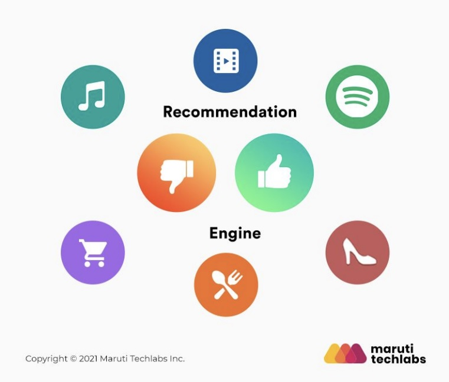
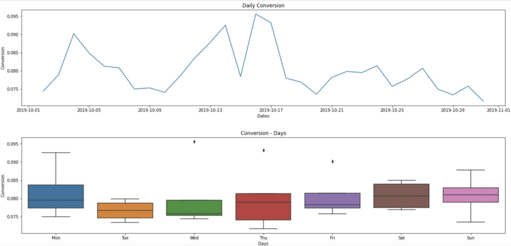
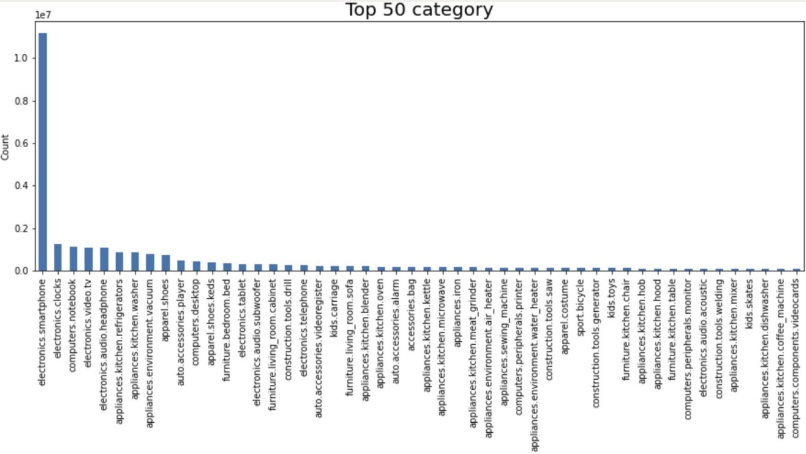
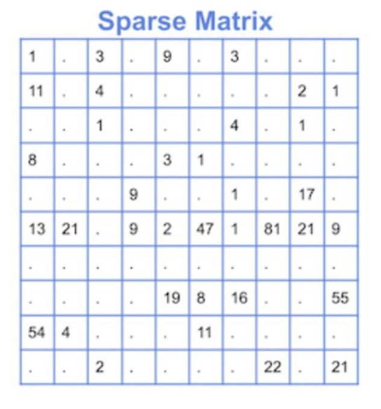

# ecommerce_recommendation

   
  
   

#### 데이터 출처 : https://www.kaggle.com/datasets/mkechinov/ecommerce-behavior-data-from-multi-category-store

## 1. 프로젝트 목적 및 배경

   
  
   

  
- 이커머스 도메인에 대한 학습을 통해 지식 습득을 전제로 한 코드스테이츠 프로젝트

- 한 달 분량의 이커머스 히스토리 데이터를 통한 분석을 진행함

- 분석을 통한 근거를 확립하고 그에 맞춘 액션 아이템의 방향성 선정

- 추천 시스템을 개발함과 결과 값에 대한 정확도 분석 및 실 사용 예시에 대한 액션 아이템과의 비교

  
## 2. 프로젝트를 통해 얻는 이익

   
  
   

- 목표 : 매출증대

- CVR(전환률)에 초점을 맞춰 매출증대를 야기 시키기 위한 분석을 진행함

- 분석을 통한 근거 확립으로 가중치를 새롭게 선정하여 그에 맞춘 추천 시스템을 개발함에 따라 매출증대를 이룰 수 있다고 판단함

  
## 3. 프로젝트 과정

  
### 3-1. 데이터 분석

  
1. CVR(전환률)에 대한 분석

   
  
   

- 기본적으로 가장 중요한 것은 CVR(전환률) 이라는 판단 하에 전환률에 대한 일별 차이에 대한 분석을 진행

2. 카테고리별 분석

   
  
   

- 각 카테고리 별 선호도를 조사함으로 데이터의 기반이 된 이커머스 기업에 대한 인기 품목을 분석함

3. 가격별 분석

- 가격에 대하여 범위를 지정해 라벨링을 진행하고, 그에 맞춰 각 범위별 구매력의 차이를 분석

### 3-2. 데이터 전처리 및 모델링 과정

- 데이터에 대한 전처리와 모델링을 위해 추천 모델에 대한 학습을 진행

- 그 결과 Sparse Matrix 데이터를 사용한 CF(협업 필터링) 모델을 사용한 모델링을 진행하기로 함

   
  
   

- 사용한 모델은 ALS, LightFM 모델을 사용

1. 전처리 과정

- 유저와 상품간의 Sparse Matrix 데이터를 위한 전처리 과정을 진행

- view, cart, purchase로 이루어진 event type에 대하여 앞서 진행한 분석 결과에 맞춰 각 가중치를 만들고 스코어링을 진행

- 가격에 대한 분석을 통해 각 라벨 별 가중치를 만들고 스코어링을 진행

- 생성한 가중치를 기반으로 하여 새롭게 스코어링을 진행하여 Sparse Matrix 데이터를 생성

- 추가적으로 Train, Test set 으로 나눔으로 데이터에 Mask를 씌워 노이즈를 생성

2. 모델링 과정

- 코사인 유사도를 통한 ALS 모델과 그에 비해 조금 더 복잡하고 정교한 선호도 개념의 LightFM 모델을 사용

- 모델링 이후에 추가적으로 유저 코드에 대하여 상위 5개의 추천 상품에 대한 Category와 Brand, Price를 보여주는 알고리즘을 구현

## 4. 프로젝트 결과

