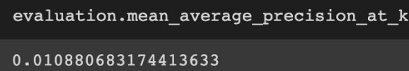
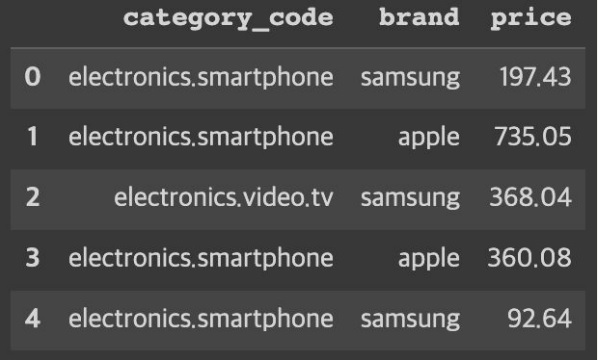
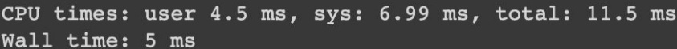
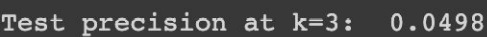
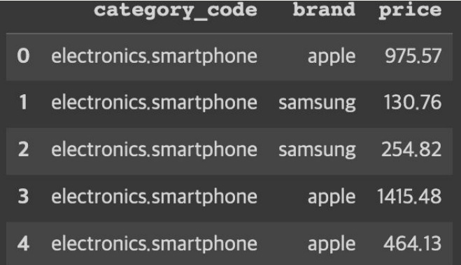
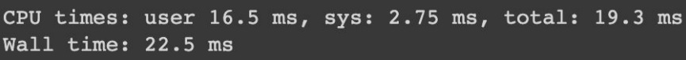

# ecommerce_recommendation

   
  
   

#### 데이터 출처 : https://www.kaggle.com/datasets/mkechinov/ecommerce-behavior-data-from-multi-category-store

## 1. 프로젝트 목적 및 배경

   
  
   

  
- 이커머스 도메인에 대한 학습을 통해 지식 습득을 전제로 한 코드스테이츠 프로젝트

- 한 달 분량의 이커머스 히스토리 데이터를 통한 분석을 진행함

- 분석을 통한 근거를 확립하고 그에 맞춘 액션 아이템의 방향성 선정

- 추천 시스템을 개발함과 결과 값에 대한 정확도 분석 및 실 사용 예시에 대한 액션 아이템과의 비교

  
## 2. 프로젝트를 통해 얻는 이익

   
  
   

- 목표 : 매출증대

- CVR(전환률)에 초점을 맞춰 매출증대를 야기 시키기 위한 분석을 진행함

- 분석을 통한 근거 확립으로 가중치를 새롭게 선정하여 그에 맞춘 추천 시스템을 개발함에 따라 매출증대를 이룰 수 있다고 판단함

  
## 3. 프로젝트 과정

  
### 3-1. 데이터 분석
  
1. CVR(전환률)에 대한 분석

   
  
   

- 기본적으로 가장 중요한 것은 CVR(전환률) 이라는 판단 하에 전환률에 대한 일별 차이에 대한 분석을 진행

2. 카테고리별 분석

   
  
   

- 각 카테고리 별 선호도를 조사함으로 데이터의 기반이 된 이커머스 기업에 대한 인기 품목을 분석함

3. 가격별 분석

- 가격에 대하여 범위를 지정해 라벨링을 진행하고, 그에 맞춰 각 범위별 구매력의 차이를 분석

### 3-2. 데이터 전처리 및 모델링 과정

- 데이터에 대한 전처리와 모델링을 위해 추천 모델에 대한 학습을 진행

- 그 결과 Sparse Matrix 데이터를 사용한 CF(협업 필터링) 모델을 사용한 모델링을 진행하기로 함

   
  
   

- 사용한 모델은 ALS, LightFM 모델을 사용

1. 전처리 과정

- 유저와 상품간의 Sparse Matrix 데이터를 위한 전처리 과정을 진행

- view, cart, purchase로 이루어진 event type에 대하여 앞서 진행한 분석 결과에 맞춰 각 가중치를 만들고 스코어링을 진행

- 가격에 대한 분석을 통해 각 라벨 별 가중치를 만들고 스코어링을 진행

- 생성한 가중치를 기반으로 하여 새롭게 스코어링을 진행하여 Sparse Matrix 데이터를 생성

- 추가적으로 Train, Test set 으로 나눔으로 데이터에 Mask를 씌워 노이즈를 생성

2. 모델링 과정

- 코사인 유사도를 통한 ALS 모델과 그에 비해 조금 더 복잡하고 정교한 선호도 개념의 LightFM 모델을 사용

- 모델링 이후에 추가적으로 유저 코드에 대하여 상위 5개의 추천 상품에 대한 Category와 Brand, Price를 보여주는 알고리즘을 구현

## 4. 프로젝트 결과

- 모델의 성능 평가는 P@K를 사용하여 진행

- 알고리즘의 경우에는 추가적으로 구현 시간이 중요하다고 판단하여 구현 시간에 대한 비교 평가를 함께 진행함

### 4-1. ALS 모델

   
  
   

- 0.011 정도의 P@K로 낮은 정도의 성능을 보임

   
  
   

- 그럼에도 알고리즘을 통한 모델 시연 결과 비슷한 제품군들에 대하여 추천을 해주는 결과를 보임

- 하지만 가격대가 일정치 못하며 가격의 편차가 큰 것을 알 수가 있음

   
  
   

- 구현 시간의 경우 굉장히 빠른 속도로 제품 추천 알고리즘을 구현하는 것을 알 수 있음

### 4-2. LightFM 모델

   
  
   

- 0.05에 가까운 성능으로 ALS 모델에 비하여 굉장히 높은 P@K를 보이는 모델이 완성

   
  
   

- 추천 알고리즘을 구현한 결과 일정한 카테고리에 대한 아이템 추천을 보임

- 대분류 카테고리 뿐만이 아닌 소분류 카테고리에 대해서도 동일한 결과를 보여주며 더 정교한 아이템 추천을 보임

- 그럼에도 가격대에 대하여 ALS 모델과 동일하게 일정치 못한 형태를 보임

   
  
   

- 구현시간 역시 ms(마이크로 초)단위로 굉장히 빠른 모습을 보임

- ALS 모델보다는 느린 속도를 나타냄

### 4-3. 모델 비교 분석 결과

- 비교 분석 결과 결국 정확도 면에서 LightFM 모델이 훨씬 정확한 모델임을 알 수가 있음

- 추가적으로 알고리즘을 동일하게 구현한 결과에 대해서도 더욱 정교한 모델임을 알 수가 있음

- 구현 시간에 대해서 LightFM 모델이 안좋다고 판단 할 수 있지만, 이 차이는 정확성에 비하여 굉장히 미미한 차이라는 판단하에 최종 모델을 LigthFM 모델로 선정

## 5. 회고

- 전처리 과정에서 가중치에 초점을 맞춰 전처리를 재차 진행한 결과 성능이 올라간 것을 확인

- 각 column의 가중치 스코어링에 대한 분석을 재차 진행하여 근거를 확립함

- 추천 알고리즘 결과물에 대하여 추천 아이템들의 가격이 아쉽지만 만족스러운 결과물이라고 판단함

- 현재 데이터의 경우 기간이 한 달로 짧지만 더욱 기간이 긴 히스토리 데이터를 통한 분석을 하고 근거를 수립해 모델링을 진행한다면 더욱 좋은 결과물을 얻을 수 있을 것이라 예상됨

- 계절성이나 재구매주기 등에 대한 근거를 찾고, 그에 맞춰 가중치를 줘서 Sparse Matrix를 만든다면 더 좋은 방향성을 제시할 수 있을 것이라고 예상

- 추가적으로 딥러닝 모델을 학습하고 구현하고자 했으나 실행하지 못한 것이 아쉬움

